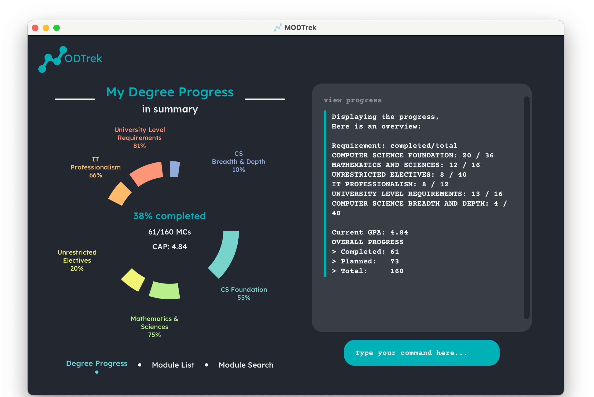
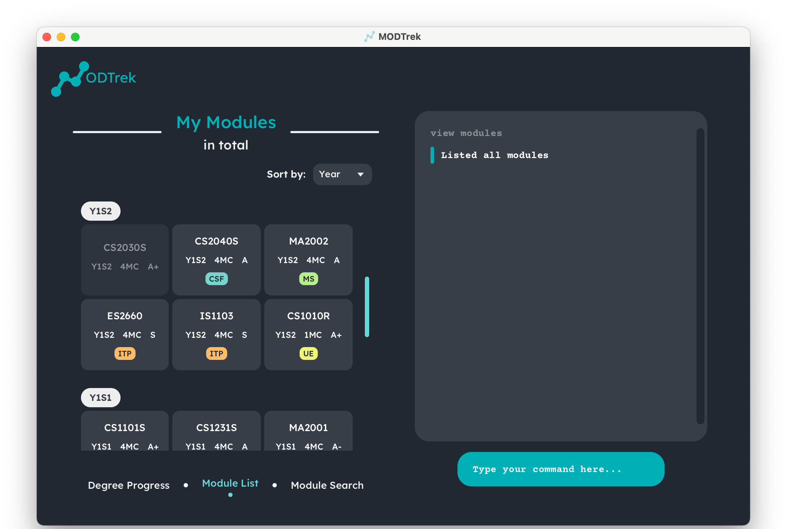

 
 

**MODTrek** is a desktop application for managing a typical NUS Computer Science student’s modules and degree progression, optimised for use via a Command Line Interface (CLI). The app provides a convenient platform for students to easily access and update their modules within presses of a keyboard.  

--------------------------------------------------------------------------------------------------------------------

## Table of Contents 

1. [How To Use This Guide](#how-to)
2. [Quick Start](#quick-start)
3. [GUI Overview](#gui-overview)
4. [Features](#features) 
   4.1 [Add a module:](#add-module) `add` 
   4.2 [Remove a/all module:](#delete-module) `delete` 
   4.3 [Change module details:](#edit-module) `edit` 
   4.4 [Tag a module:](#tag-module) `tag` 
   4.5 [Find modules by keyword:](#find-module) `find` 
   4.6 [Sort all modules:](#sort-module) `sort` 
   4.7 [Toggle between module lists and progress:](#change-view) `view` 
   4.8 [Exiting the program:](#exit-app) `exit` 
   4.9 [Saving the data](#save-data) 
   4.10 [Editing the data file](#edit-data)
5. [Frequently Asked Questions (FAQ)](#faq)
6. [Command Summary](#command-summary)

--------------------------------------------------------------------------------------------------------------------

## 1. How to Use This Guide 

Not sure how you can begin using **MODTrek**? This user guide will give you all the information you will need so
that you can utilise **MODTrek** to its full potential.

To get started, we have prepared a [Quick Start](#quick-start) section in this user guide to ensure that you will
have a seamless setting up process.

You can also familiarize yourself with the GUI in our [GUI Overview](#gui-overview) section where you will get a 
quick breakdown of our GUI.

Not sure what features **MODTrek** has or how to use them? Our [Features](#features) section provides an in depth
explanation of **MODTrek** can do and how you can use them effectively. Alternatively, you can go to our [Command Summary](#command-summary)
section for a quick overview of all the commands.

Commonly asked questions and answers can be found in our [FAQ](#faq) but if you are still unable to find what you are
looking for, feel free to contact us at our [GitHub](https://github.com/AY2223S2-CS2103T-T13-1/tp).

Before going any further, here are some useful notations that you should know.

**Tips**

Tips are useful suggestions that will help you become a seasoned **MODTrek** user more quickly.

:bulb: **Tip:** Tips are useful information. They can give you a better experience with **MODTrek**.

**Notes**

Notes are important information that you should pay attention to when using **MODTrek**.

:information_source: **Note:** Take notes when you see this icon.

**Caution**

Cautions are in place to warn you of potential pitfalls new users may encounter.

:exclamation: **Caution:** Stop and read carefully when you see this!

[Back to Table of Contents](#toc)

--------------------------------------------------------------------------------------------------------------------

## 2. Quick Start 

1. Ensure you have Java 11 or above installed in your Computer.
2. Download `modtrek.jar` [here](https://github.com/AY2223S2-CS2103T-T13-1/tp/releases).
3. Copy the file to the folder you want to use as the _home folder_ for **MODTrek**.
4. Lauch the app by double-clicking the file or by navigating to the file using your command terminal, and
running `java -jar modtrek.jar` in your terminal. 
5. A GUI similar to the one below should appear in a few seconds. 
6. Type commands within the command line interface (CLI) and press enter to execute it. For a list of executable commands, refer to the [Features](#features) section.

[Back to Table of Contents](#toc)

--------------------------------------------------------------------------------------------------------------------

## 3. GUI Overview 

The following is an annotated breakdown of **MODtrek's** GUI:

1. **Command Input:** User inputs commands here.
2. **Command Screen:** Relevant messages from the application will be displayed here. This includes success messages, error
messages and resul
3. **Results Section:** This panel shows the degree progression of the user by default. This panel can be changed using the `view` command
to toggle between the module list in **MODTrek** or the user's degree progression as well as using the `sort` and `find` command when making 
a query on the module list.

[Back to Table of Contents](#toc)

--------------------------------------------------------------------------------------------------------------------

## 4. Features 

:information_source: **Notes about command format:** 

* Words enclosed by `<>` are the parameters to be supplied by the user. 
E.g. in `add /m <code>`, `<code>` is a parameter which can be replaced by `CS2030S` to give the command `add /m CS2030S`.
  
* Parameters encapsulated in between round brackets are optional. 
E.g. in `delete /m <code1> (/m <code2>)` can be used as `delete /m CS1101S /m CS1231` or as `delete /m CS1101S`.

* Parameters with `...` after them can be used 1 or more times. 
E.g. in `(/t <tag>...)` can be used as `/t ULR /t CSF`, `/t ULR`.

* Extraneous parameters for commands that do not take in parameters (such as `list`, `exit` and `delete all`) will be ignored.
E.g. if the command specifies `list 123`, it will be interpreted as `list`

### MODTrek supports the following features:

#### 4.1 Add a Module : `add` 

Adds a module to the module list. Modules must be distinct.

**Syntax:** `add /m <code> /c <credits> /y <year-semester> (/g <grade>) (/t <tag>...)`

Additional details:
* `<code>` refers to the module code
* `<credits>` refers to the module's modular credits
* `<year-semester>` refers to the year and semester the module is taken. E.g. y1s2, y3st1
* `<grade>` refers to the grade obtained for the module. Range from A+ to U.
* `<tag>` refers to the requirement the modules fulfils. This includes:
   * `ULR` University Level Requirements
   * `CSF` Computer Science Foundations
   * `CSBD` Computer Science Breadth & Depth
   * `UE` Unrestricted Electives
   * `ITP` IT Professionalism
   * `MS` Math & Science

:bulb: **Tip:** A module can have more than 1 tags (including 0).

**Example:** 
* `add /m CS2103T /c 4 /y y2s2 /g A /t ULR`
* `add /m GESS1025 /c 4 /y y1s2`

[Back to Table of Contents](#toc)

#### 4.2 Delete a Module : `delete` 

Deletes the specified module(s) from the module list.

**Syntax:**
* _To delete specific modules:_ `delete /m <code1> (/m <code2>...)`
* _To delete all modules:_ `delete all`

:bulb: **Tip:** You can use the same instance of the delete command to delete more than 1 module at a time but at least
1 module to be deleted must be specified.

**Example:** 
* `delete /m CS2100 /m CS2040S`
* `delete /m MA1521`
* `delete all`

[Back to Table of Contents](#toc)

#### 4.3 Edit a Module : `edit` 

Edits an existing module in the module list.

**Syntax:** `edit <existing code> <toEdit>...`

Specify one or more parameters in `<toEdit>` that you want to edit. This can be:
* `/m <new code>`
* `/c <credit>`
* `/y <year-semester>`
* `/g <grade>`
* `/t <tag>`

:exclamation: **Caution:** Past data will be overridden and not be saved

**Example:** 
* `edit ES2660 /m CS2101 /g B+ /t MS`
* `edit CS2107 /y y3s1`

[Back to Table of Contents](#toc)

#### 4.4 Tag a Module : `tag` 

Tags a module to include or remove one or more degree requirements (e.g. University Level Requirements, Computer Science Foundation etc) that the module fulfils. 
Refer to [Add a module](#add-module) for the tags that you can use.

**Syntax:**
* _To include tags:_ `tag <code> include <tag1> (<tag2>...)`
* _To remove tags:_ `tag <code> remove <tag1> (<tag2>...)`

**Example:**
* `tag CS2030S include CSF`
* `tag ES2660 remove ULR ITP`

[Back to Table of Contents](#toc)

#### 4.5 Find modules by keyword(s) : `find` 

Displays specific module(s) and their details previously logged by the user which satisfies the keyword(s) queried.

**Syntax:** `find <keyword>...`

Specify one or more parameters in `<keywords>` that you want to find your modules by. This can be:
* `/m <code>`
* `/c <credit>`
* `/y <year-semester>`
* `/g <grade>`
* `/t <tag>`

:bulb: **Tip:** Using more keywords will filter the results you want to find further.

**Example:**
* `find /c 4 /g A+`
* `find /y y2s2`
* `find /m cs /g A+` 

[Back to Table of Contents](#toc)

#### 4.6 Sort all modules : `sort` 

Sort the modules according to the category indicated by the user.

**Syntax:** `sort <category>`

Categories that modules can be sorted by are:
* `/m` to sort by module code
* `/c` to sort by credit
* `/y` to sort by year-semester
* `/g` to sort by grade
* `/t` to sort by tag

**Example:** `sort /g`

[Back to Table of Contents](#toc)

#### 4.7 Toggle screens : `view` 

Toggles between the display of degree progress or module list.

**Syntax:**
* _To view degree progression:_ `view progress` 
* _To view module list:_ `view modules` 

[Back to Table of Contents](#toc)

#### 4.8 Exit MODTrek : `exit` 

Exits the program. Alternatively you can exit the program by clicking the top-right X button to close the window.

**Syntax:** `exit`

[Back to Table of Contents](#toc)

#### 4.9 Saving MODTrek data 

Saves the modified data regarding the modules into the hard disk automatically after any command that changes the data. There is no need to save manually.

[Back to Table of Contents](#toc)

#### 4.10 Editing MODTrek data 

ModTrek data is saved as a JSON file [JAR file location]/data/modtrek.json. Advanced users are welcome to update data directly by editing that data file.

:exclamation: **Caution:** If your changes to the data file makes its format invalid, **MODTrek** will discard all data and start with an empty data file at the next run.

[Back to Table of Contents](#toc)

--------------------------------------------------------------------------------------------------------------------

## 5. Frequently Asked Questions (FAQ) 

**Q**: Why is it that I can add in modules not offered in NUS 
**A**: Unfortunately we do not have a database to store all the available modules in NUS.
We can only check if the module code is formatted correctly, and we trust users to key in modules that
are provided only by NUS.

**Q**: Why are the old terms (modules, CAP, MCs) used when referring to modules information 
**A**: We used these terms to specifically cater to our target audience, who are CS students students matriculated in AY 21/22.

[Back to Table of Contents](#toc)

--------------------------------------------------------------------------------------------------------------------

## 6. Command Summary 

| Action   | Format, Examples                                                                                                                                          |
|----------|-----------------------------------------------------------------------------------------------------------------------------------------------------------|
| **Add**  | `add /m <code> /c <credits> /y <year-semester> (/g <grade>) (/t <tag>...)`  e.g., `add /m CS2103T /c 4 /y y2s2 /g A /t ULR`                            |
| **Delete** | `delete /m <code1> (/m <code2>...)` or `delete all`  e.g. `delete /m CS2100 /m CS2040S`                                                                |
| **Edit** | `edit <existing code> (/m <new code>) (/c <credits>) (/y <year-semester>) (/g <grade>) (/t <tag>...)`   e.g., `edit ES2660 /m CS2101`                  |
| **Tag**  | `tag /m <code> include <tag1> (<tag2>...)` or `tag /m <code> remove <tag1> (<tag2>...)`   e.g., `tag CS2030S include CSF`, `tag ES2660 remove ULR ITP` |
| **Find** | `find (/m <code>) (/c <credits>) (/y <year-semester>) (/g <grade>)`   e.g., `find /g A+`                                                               |
| **Sort** | `sort <category>`  e.g. `sort /m`                                                                                                                      |
| **View** | `view progress` or `view modules`                                                                                                                         |
| **Exit** | `exit`                                                                                                                                                    |

:information_source: **Note:** Parameters encapsulated in between brackets `()` are optional.

For `edit`, at least one optional parameter has to be specified.

[Back to Table of Contents](#toc)

